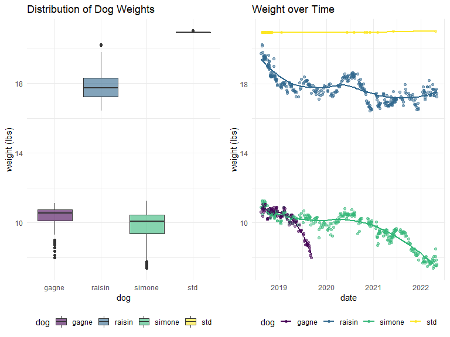

p8105_mtp_qz2493.Rmd
================
Qingyue Zhuo qz2493
2022-10-22

### Problem 1

The raw data records the weight of three dogs - Raisin, Simone, and
Gagne from 2018 to 2022, together with the weight of a standard object
and occasional notes. The goal of this report includes:  
1. Tidy and restructure the dataset into a more readable version  
2. Describe the statistical features of the dataset  
3. Visualize the distribution and trend of dogs’ weight

#### import and tidy the data

After loading the raw data, I converted the format of “date” variable
from “day-counts” to “year-month-date”.

``` r
total_df = 
  read_excel("dogweights_07may2022.xlsx", skip = 1) %>%
  janitor::clean_names() %>%
  
  # reorganize the "date" variable
  mutate(
    date = as.POSIXlt.numeric(as.numeric(date)*24*60*60, tz = "UTC", origin = "1899-12-30"),
    date = as.character(date),
    date = substr(date, 1, 10)
    ) 
```

    ## New names:
    ## • `` -> `...6`

The first dataframe contains the weight of dogs overtime. I unified the
unit of weight to “lbs” to increase consistency. I corrected two
measurement/recording errors in the table after comparing them with
other observations:  
1. Raisin’s weight should be 17.9375 rather than 7.375 pounds on
14-Aug-2019.  
2. Weight of the standard object should be 21.027 instead of 29.625
pounds on 25-Apr-2022.

``` r
weight_df =
  select(total_df, date:std) %>%
  
  # separate the weight measurements by unit
  separate(raisin, into = c("raisin_lbs", "raisin_oz")) %>%
  separate(simone, into = c("simone_lbs", "simone_oz")) %>%
  separate(gagne, into = c("gagne_lbs", "gagne_oz")) %>%
  separate(std, into = c("std_lbs", "std_oz")) %>%
  
  # unify the unit to "lbs"
  mutate(
    raisin = as.numeric(raisin_lbs) + (1/16) * as.numeric(raisin_oz),
    simone = as.numeric(simone_lbs) + (1/16) * as.numeric(simone_oz),
    gagne = as.numeric(gagne_lbs) + (1/16) * as.numeric(gagne_oz),
    std = as.numeric(std_lbs) + (1/16) * as.numeric(std_oz)) %>%
  select(date, raisin:std) %>%
  
  # correct the measurement/ recording errors
  mutate(
    raisin = ifelse(raisin < 10, raisin + 10, raisin),
    std = ifelse(std == 29.6250, 20 + 15.4/15, std)
  )

weight_df 
```

    ## # A tibble: 361 × 5
    ##   date       raisin simone gagne   std
    ##   <chr>       <dbl>  <dbl> <dbl> <dbl>
    ## 1 2018-08-12   19.8   10.9  10.6  NA  
    ## 2 2018-08-19   20.2   11.1  10.8  20.9
    ## 3 2018-08-22   20.2   11.2  10.8  20.9
    ## # … with 358 more rows

The second dataset contains notes and the date on which they were
written.

``` r
note_df = 
  select(total_df, date, x6) %>%
  rename("note" = "x6") %>%
  # drop the dates without written notes
  drop_na()
note_df
```

    ## # A tibble: 26 × 2
    ##   date       note                                     
    ##   <chr>      <chr>                                    
    ## 1 2018-08-27 Right after leaving for 3 days at Weber's
    ## 2 2018-09-04 at camp bow wow                          
    ## 3 2018-10-01 dogs at Webers from Sept 18-30           
    ## # … with 23 more rows

#### save the tidy datasets

``` r
write_csv(weight_df, "weight_data.csv")
write_csv(note_df,"note.csv")
```

### Problem 2

#### load csv. data

``` r
weight_data = read_csv("weight_data.csv")
```

    ## Rows: 361 Columns: 5
    ## ── Column specification ────────────────────────────────────────────────────────
    ## Delimiter: ","
    ## dbl  (4): raisin, simone, gagne, std
    ## date (1): date
    ## 
    ## ℹ Use `spec()` to retrieve the full column specification for this data.
    ## ℹ Specify the column types or set `show_col_types = FALSE` to quiet this message.

``` r
note_data = read_csv("note.csv")
```

    ## Rows: 26 Columns: 2
    ## ── Column specification ────────────────────────────────────────────────────────
    ## Delimiter: ","
    ## chr  (1): note
    ## date (1): date
    ## 
    ## ℹ Use `spec()` to retrieve the full column specification for this data.
    ## ℹ Specify the column types or set `show_col_types = FALSE` to quiet this message.

The resulting weight dataset contains 361 observations of 5 variables
including date, raisin, simone, gagne, std. There are 360 unique dates
that are non-NA.

#### obtain the number of unique date

``` r
# number of distinct date
weight_data %>% 
  select(date) %>%
  distinct 
```

    ## # A tibble: 361 × 1
    ##   date      
    ##   <date>    
    ## 1 2018-08-12
    ## 2 2018-08-19
    ## 3 2018-08-22
    ## # … with 358 more rows

``` r
# number of date that is non-NA
sum(!is.na(weight_data$date))
```

    ## [1] 360

#### generate table of observation counts, mean, and standard deviation

I applied pivot_longer to incorperate three dogs and the standard object
into a new variable named “dog”. Their weights were stored in another
new variable called “weight”.  
I grouped the dogs by name and obtained the number of observations as
well as mean and standard deviations of each dog.

``` r
weight_data %>%
  
  # create new variables of "dog name" and "dog weights"
  pivot_longer(
    raisin:std,
    names_to = "dog",
    values_to = "weight"
  ) %>%
  
  # group dogs by name
  arrange(dog) %>%
  group_by(dog) %>%
  summarize(
    total_observations = sum(!is.na(weight)),
    mean = round(mean(weight,na.rm = TRUE),3),
    standard_deviation = round(sd(weight, na.rm = TRUE),3)
) %>%
  
  # generate a well-formatted table
  knitr::kable()
```

| dog    | total_observations |   mean | standard_deviation |
|:-------|-------------------:|-------:|-------------------:|
| gagne  |                120 | 10.295 |              0.706 |
| raisin |                353 | 17.811 |              0.775 |
| simone |                334 |  9.791 |              0.916 |
| std    |                 46 | 20.941 |              0.016 |

### Problem 3

``` r
weight_data_pivot = 
  weight_data %>%
  pivot_longer(
    raisin:std,
    names_to = "dog",
    values_to = "weight")
```

#### create boxplot of weights distribution

I generated a boxplot to display the distribution of weight for each
dog. We can conclude from the plot that  
1. Raisin weighs the most, with an average weight of around 18 lbs,
while Gagne and Simone weigh less and similarly, with an average weight
of around 10 lbs.  
2. Simon’s weight has the greatest variance as its boxplot spread out
the most. Gagne’s weight has the smallest variance, it might be because
Gagne has minimal data recorded.

``` r
plot1 =
  ggplot(weight_data_pivot, aes(x = dog, y = weight, fill = dog)) +
  geom_boxplot() +
  scale_fill_viridis(discrete = TRUE, alpha = 0.6) +
  labs(
    title = "Distribution of Dog Weights",
    y = "weight (lbs)")
```

#### generate scatter plot of weight over time

I created a scatter plot to show each dog’s weight over time. We can
conclude that  
1. Dogs’ weight decreased gradually since 2018 as they got older.
Gagne’s weight dropped rapidly during the last six months of his life.
Simone’s weight dropped smoothly upon being diagnosed with a
neurological problem at the beginning of 2021.  
2. For Raisin and Simone, their weights follow a similar fluctuation
pattern. For example, they both underwent a weight decrease after their
company Gagne died; a weight increase during the first half of 2021
followed by a decrease in the next six months.  
3. According to the notes, dogs’ weight tends to decrease at Weber’s or
the kennel, and increase at PC.  
4. In conclusion, as an important indicator of health and well-being, a
dog’s weight is affected by both internal(physical health) and
external(location, other dogs) factors.

``` r
plot2 = 
  ggplot(weight_data_pivot, aes(x = date, y = weight, color = dog)) + 
  geom_smooth(se = FALSE, alpha = .5) +
  geom_point(aes(color = dog), alpha = .5) +
  labs(
    title = "Weight over Time",
    x = "date",
    y = "weight (lbs)")
  
combined_plot = grid.arrange(plot1, plot2, nrow = 1)
```

    ## `geom_smooth()` using method = 'loess' and formula 'y ~ x'



``` r
ggsave("dog_weight_plot.pdf", combined_plot, width = 8, height = 5)
```
