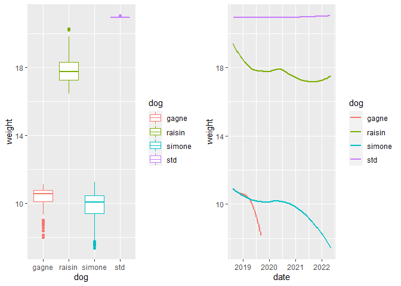

p8105_mtp_qz2493.Rmd
================
Qingyue Zhuo qz2493
2022-10-22

\###problem 1 \####

\###import and tidy the dataset

``` r
total_df = 
  read_excel("dogweights_07may2022.xlsx", skip = 1) %>%
  janitor::clean_names() %>%
  mutate(
    date = as.POSIXlt.numeric(as.numeric(date)*24*60*60, tz = "UTC", origin = "1899-12-30"),
    date = as.character(date),
    date = substr(date, 1, 10)
    ) 
```

    ## New names:
    ## • `` -> `...6`

    ## Warning in as.POSIXlt(as.POSIXct(origin, tz = "UTC", ...) + x, tz = tz): NAs
    ## introduced by coercion

``` r
weight_df =
  select(total_df, date:std) %>%
  separate(raisin, into = c("raisin_lbs", "raisin_oz")) %>%
  separate(simone, into = c("simone_lbs", "simone_oz")) %>%
  separate(gagne, into = c("gagne_lbs", "gagne_oz")) %>%
  separate(std, into = c("std_lbs", "std_oz")) %>%
  mutate(
    raisin = as.numeric(raisin_lbs) + (1/16) * as.numeric(raisin_oz),
    simone = as.numeric(simone_lbs) + (1/16) * as.numeric(simone_oz),
    gagne = as.numeric(gagne_lbs) + (1/16) * as.numeric(gagne_oz),
    std = as.numeric(std_lbs) + (1/16) * as.numeric(std_oz)) %>%
  select(date, raisin:std) %>%
  mutate(
    raisin = ifelse(raisin < 10, raisin + 10, raisin),
    std = ifelse(std == 29.6250, 20 + 15.4/15, std)
  )
```

    ## Warning: Expected 2 pieces. Missing pieces filled with `NA` in 3 rows [40, 117,
    ## 210].

    ## Warning: Expected 2 pieces. Additional pieces discarded in 45 rows [2, 3, 4, 5,
    ## 7, 9, 11, 12, 13, 14, 15, 16, 17, 18, 19, 20, 21, 22, 23, 24, ...].

``` r
note_df = 
  select(total_df, date, x6) %>%
  rename("note" = "x6") %>%
  drop_na()
```

``` r
write_csv(weight_df, "weight_data.csv")
write_csv(note_df,"note.csv")
```

\###Problem 2

``` r
weight_data = read_csv("weight_data.csv")
```

    ## Rows: 361 Columns: 5
    ## ── Column specification ────────────────────────────────────────────────────────
    ## Delimiter: ","
    ## dbl  (4): raisin, simone, gagne, std
    ## date (1): date
    ## 
    ## ℹ Use `spec()` to retrieve the full column specification for this data.
    ## ℹ Specify the column types or set `show_col_types = FALSE` to quiet this message.

``` r
note_data = read_csv("note.csv")
```

    ## Rows: 26 Columns: 2
    ## ── Column specification ────────────────────────────────────────────────────────
    ## Delimiter: ","
    ## chr  (1): note
    ## date (1): date
    ## 
    ## ℹ Use `spec()` to retrieve the full column specification for this data.
    ## ℹ Specify the column types or set `show_col_types = FALSE` to quiet this message.

``` r
#the number of distinct date
weight_data %>% 
  select(date)
```

    ## # A tibble: 361 × 1
    ##    date      
    ##    <date>    
    ##  1 2018-08-12
    ##  2 2018-08-19
    ##  3 2018-08-22
    ##  4 2018-08-24
    ##  5 2018-08-27
    ##  6 2018-08-28
    ##  7 2018-08-29
    ##  8 2018-08-30
    ##  9 2018-08-31
    ## 10 2018-09-01
    ## # … with 351 more rows

``` r
  distinct 
```

    ## function (.data, ..., .keep_all = FALSE) 
    ## {
    ##     UseMethod("distinct")
    ## }
    ## <bytecode: 0x000002e6bd57a420>
    ## <environment: namespace:dplyr>

``` r
#the number of date that is non-NA
sum(!is.na(weight_data$date))
```

    ## [1] 360

``` r
weight_data %>%
  pivot_longer(
    raisin:std,
    names_to = "dog",
    values_to = "weight"
  ) %>%
  arrange(dog) %>%
  group_by(dog) %>%
  summarize(
    total_observations = sum(!is.na(weight)),
    mean = mean(weight,na.rm = TRUE),
    standard_deviation = sd(weight, na.rm = TRUE)
) %>%
  knitr::kable()
```

| dog    | total_observations |      mean | standard_deviation |
|:-------|-------------------:|----------:|-------------------:|
| gagne  |                120 | 10.295312 |          0.7055249 |
| raisin |                353 | 17.810552 |          0.7749365 |
| simone |                334 |  9.790606 |          0.9157577 |
| std    |                 46 | 20.940797 |          0.0158863 |

\###Problem 3

``` r
weight_data_pivot = 
  weight_data %>%
  pivot_longer(
    raisin:std,
    names_to = "dog",
    values_to = "weight"
  )
```

``` r
plot1 =
  ggplot(weight_data_pivot, aes(x = dog, y = weight, color = dog)) + geom_boxplot()

plot2 = 
  ggplot(weight_data_pivot, aes(x = date, y = weight, color = dog)) + 
  geom_smooth(se = FALSE) 

grid.arrange(plot1, plot2, nrow = 1)
```

    ## Warning: Removed 591 rows containing non-finite values (stat_boxplot).

    ## `geom_smooth()` using method = 'loess' and formula 'y ~ x'

    ## Warning: Removed 594 rows containing non-finite values (stat_smooth).

<!-- -->
