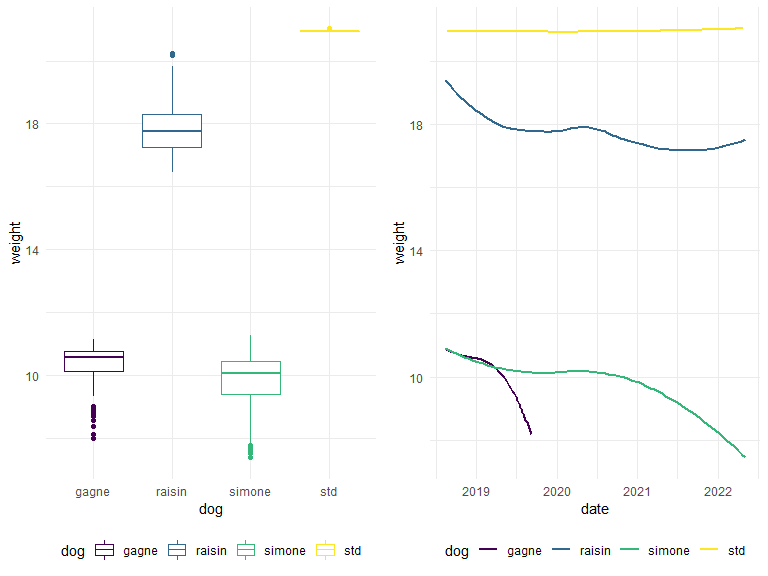

p8105_mtp_qz2493.Rmd
================
Qingyue Zhuo qz2493
2022-10-22

### Problem 1

The raw data records the weight of three dogs - Raisin, Simone, Gagne
from 2018 to 2022, together with a standard object and occasional notes.
The goal of this report includes tidying and restructuring the data set
into a more readable manner; describing the statistical features of the
data set; and visualizing the the distribution and trend of dogs’
weight.

#### import and tidy the data

After loading the raw data, I converted the format of “date” variable
from “day-counts” to “year-month-date” with as.POSIXlt() function.

``` r
total_df = 
  read_excel("dogweights_07may2022.xlsx", skip = 1) %>%
  janitor::clean_names() %>%
  
  # reorganize the "Date" variable
  mutate(
    date = as.POSIXlt.numeric(as.numeric(date)*24*60*60, tz = "UTC", origin = "1899-12-30"),
    date = as.character(date),
    date = substr(date, 1, 10)
    ) 
```

    ## New names:
    ## • `` -> `...6`

The first dataframe contains the weight of dogs on specific dates. I
unified the unit of weight to “lbs” to increase consistency. I then
manually corrected two measurement/record errors in the table after
comparing with other observations: Raisin’s weight should be 17.9375
rather than 7.375 pounds on 14-Aug-2019; and the weight of standard
object should be 21.027 instead of 29.625 pounds on 25-Apr-2022.

``` r
weight_df =
  select(total_df, date:std) %>%
  
  # separate the weight measurements by unit
  separate(raisin, into = c("raisin_lbs", "raisin_oz")) %>%
  separate(simone, into = c("simone_lbs", "simone_oz")) %>%
  separate(gagne, into = c("gagne_lbs", "gagne_oz")) %>%
  separate(std, into = c("std_lbs", "std_oz")) %>%
  
  # unify the unit to "lbs"
  mutate(
    raisin = as.numeric(raisin_lbs) + (1/16) * as.numeric(raisin_oz),
    simone = as.numeric(simone_lbs) + (1/16) * as.numeric(simone_oz),
    gagne = as.numeric(gagne_lbs) + (1/16) * as.numeric(gagne_oz),
    std = as.numeric(std_lbs) + (1/16) * as.numeric(std_oz)) %>%
  select(date, raisin:std) %>%
  
  # correct the measurement/ recording errors
  mutate(
    raisin = ifelse(raisin < 10, raisin + 10, raisin),
    std = ifelse(std == 29.6250, 20 + 15.4/15, std)
  )

weight_df 
```

    ## # A tibble: 361 × 5
    ##    date       raisin simone gagne   std
    ##    <chr>       <dbl>  <dbl> <dbl> <dbl>
    ##  1 2018-08-12   19.8   10.9  10.6  NA  
    ##  2 2018-08-19   20.2   11.1  10.8  20.9
    ##  3 2018-08-22   20.2   11.2  10.8  20.9
    ##  4 2018-08-24   19.8   11.2  11.1  20.9
    ##  5 2018-08-27   19.4   10.5  10.4  20.9
    ##  6 2018-08-28   NA     NA    NA    NA  
    ##  7 2018-08-29   19.4   11    11.1  20.9
    ##  8 2018-08-30   NA     NA    NA    NA  
    ##  9 2018-08-31   19.6   11    10.8  20.9
    ## 10 2018-09-01   NA     NA    NA    NA  
    ## # … with 351 more rows

The second dataset contains the notes and date on which they are
written.

``` r
note_df = 
  select(total_df, date, x6) %>%
  rename("note" = "x6") %>%
  # drop the dates without written notes
  drop_na()
note_df
```

    ## # A tibble: 26 × 2
    ##    date       note                                                              
    ##    <chr>      <chr>                                                             
    ##  1 2018-08-27 Right after leaving for 3 days at Weber's                         
    ##  2 2018-09-04 at camp bow wow                                                   
    ##  3 2018-10-01 dogs at Webers from Sept 18-30                                    
    ##  4 2018-10-09 dogs at Webers from Oct 5-8                                       
    ##  5 2018-10-16 on 10/15 all had hair cuts                                        
    ##  6 2018-10-22 dogs at Webers from Oct 18-22                                     
    ##  7 2018-11-18 dogs at Webers from Nov 10-17                                     
    ##  8 2019-01-08 Simone/Gagne  at Webers from Dec 20-Jan 4, Raisin at PC Dec 20-Ja…
    ##  9 2019-09-06 Gagne died 9/8/2019                                               
    ## 10 2019-11-04 on vacation? Dogs at kennel?                                      
    ## # … with 16 more rows

#### save the tidy datasets

``` r
write_csv(weight_df, "weight_data.csv")
write_csv(note_df,"note.csv")
```

### Problem 2

``` r
weight_data = read_csv("weight_data.csv")
```

    ## Rows: 361 Columns: 5
    ## ── Column specification ────────────────────────────────────────────────────────
    ## Delimiter: ","
    ## dbl  (4): raisin, simone, gagne, std
    ## date (1): date
    ## 
    ## ℹ Use `spec()` to retrieve the full column specification for this data.
    ## ℹ Specify the column types or set `show_col_types = FALSE` to quiet this message.

``` r
note_data = read_csv("note.csv")
```

    ## Rows: 26 Columns: 2
    ## ── Column specification ────────────────────────────────────────────────────────
    ## Delimiter: ","
    ## chr  (1): note
    ## date (1): date
    ## 
    ## ℹ Use `spec()` to retrieve the full column specification for this data.
    ## ℹ Specify the column types or set `show_col_types = FALSE` to quiet this message.

``` r
#the number of distinct date
weight_data %>% 
  select(date)
```

    ## # A tibble: 361 × 1
    ##    date      
    ##    <date>    
    ##  1 2018-08-12
    ##  2 2018-08-19
    ##  3 2018-08-22
    ##  4 2018-08-24
    ##  5 2018-08-27
    ##  6 2018-08-28
    ##  7 2018-08-29
    ##  8 2018-08-30
    ##  9 2018-08-31
    ## 10 2018-09-01
    ## # … with 351 more rows

``` r
  distinct 
```

    ## function (.data, ..., .keep_all = FALSE) 
    ## {
    ##     UseMethod("distinct")
    ## }
    ## <bytecode: 0x0000024def304478>
    ## <environment: namespace:dplyr>

``` r
#the number of date that is non-NA
sum(!is.na(weight_data$date))
```

    ## [1] 360

``` r
weight_data %>%
  pivot_longer(
    raisin:std,
    names_to = "dog",
    values_to = "weight"
  ) %>%
  arrange(dog) %>%
  group_by(dog) %>%
  summarize(
    total_observations = sum(!is.na(weight)),
    mean = mean(weight,na.rm = TRUE),
    standard_deviation = sd(weight, na.rm = TRUE)
) %>%
  knitr::kable()
```

| dog    | total_observations |      mean | standard_deviation |
|:-------|-------------------:|----------:|-------------------:|
| gagne  |                120 | 10.295312 |          0.7055249 |
| raisin |                353 | 17.810552 |          0.7749365 |
| simone |                334 |  9.790606 |          0.9157577 |
| std    |                 46 | 20.940797 |          0.0158863 |

### Problem 3

``` r
weight_data_pivot = 
  weight_data %>%
  pivot_longer(
    raisin:std,
    names_to = "dog",
    values_to = "weight"
  )
```

``` r
plot1 =
  ggplot(weight_data_pivot, aes(x = dog, y = weight, color = dog)) + geom_boxplot()

plot2 = 
  ggplot(weight_data_pivot, aes(x = date, y = weight, color = dog)) + 
  geom_smooth(se = FALSE) 

grid.arrange(plot1, plot2, nrow = 1)
```

    ## `geom_smooth()` using method = 'loess' and formula 'y ~ x'


